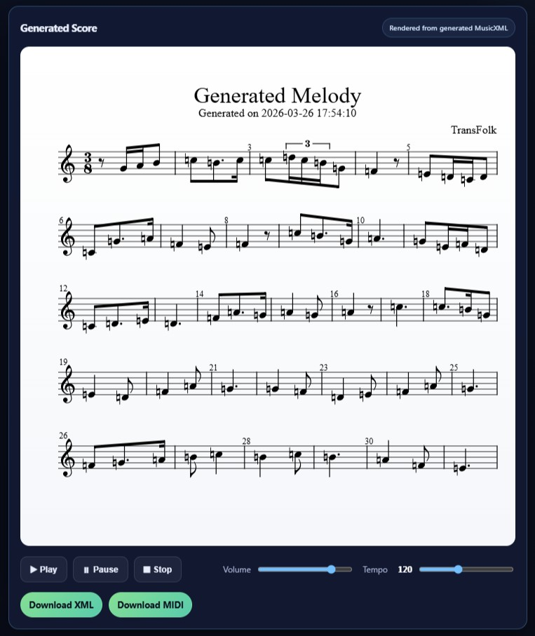
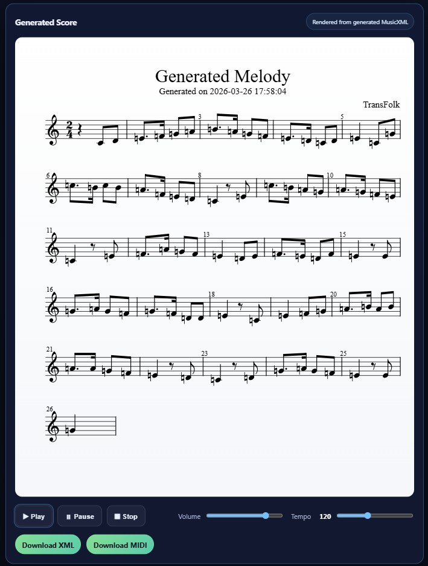
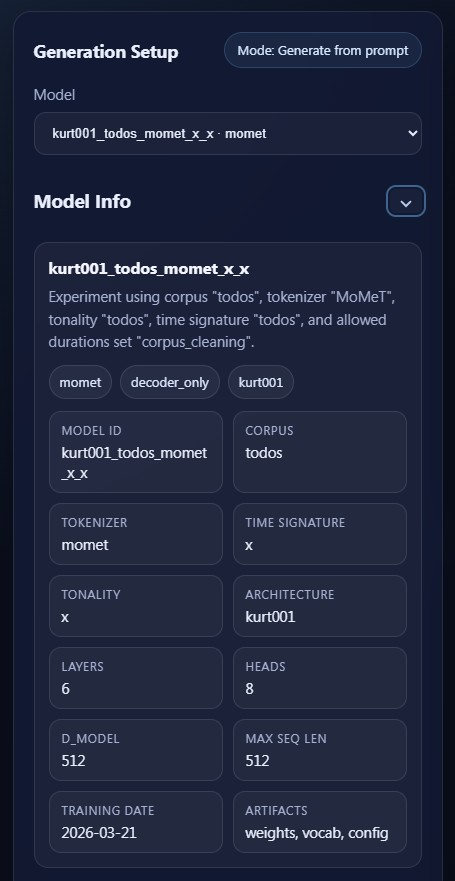
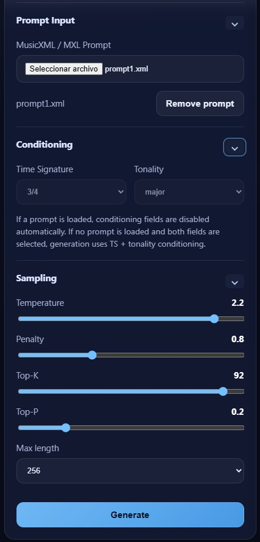
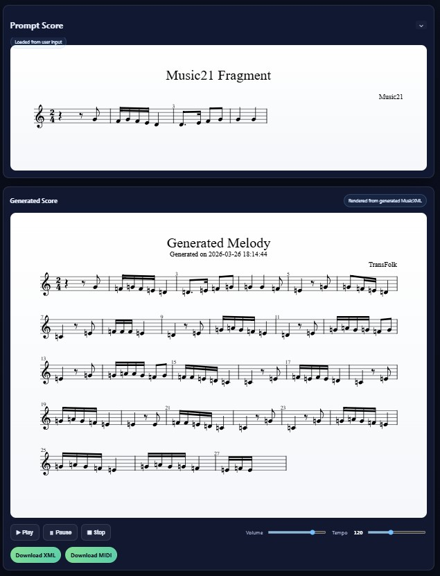

# TransFolk
<p>
  <b>Transformer-based Folk Melody Generation</b><br>
  Symbolic AI for structured, style-aware music generation
</p>

**TransFolk** is a transformer-based system for generating monophonic folk melodies from a curated Iberian corpus. It provides an end-to-end pipeline covering preprocessing, tokenisation, training, generation, and evaluation of symbolic music.

The platform integrates **data preprocessing, tokenisation, training, generation, evaluation, API deployment, and an interactive frontend**.

---

## Product Preview


### Generated Melodies

Outputs are rendered as structured musical scores:

<p align="center">
  
</p>

<p align="center">
  
</p>

---

### Interactive Model Inspection

Each model exposes full metadata for reproducibility and analysis:

<p align="center">
  
</p>

---

### Generation Control Interface

Fine-grained control over sampling parameters:

<p align="center">
  
</p>

---

### Prompt Conditioning

The system allows generation conditioned on real symbolic input:

<p align="center">
  
</p>


---

## Features

* Decoder-only Transformer (PyTorch)
* Modular design for future architectures (encoder-decoder, hierarchical, etc.)

* Multiple tokenisation strategies:

  * Event-based (baseline)
  * Metric-aware
  * Pattern-aware
* Support for:

  * Time signatures (2/4, 3/4, 6/8)
  * Mode conditioning (major / minor)
* MusicXML and MIDI generation
* MIDI (playback-ready)
* Full preprocessing pipeline from raw symbolic data
* Evaluation framework including:
  * Token entropy and conditional entropy
  * Modal stability
  * Pattern retention metrics
  * One-class style classification
* API for generation (FastAPI backend)
* Frontend integration (music rendering + playback)

---

## Project Structure

```
transfolk/                # Core model and training logic
transfolk_tokenization/   # Tokenisation pipelines
transfolk_config/         # Configuration system and ORM
transfolk_metrics/        # Evaluation metrics
transfolk_classifier/     # Style classification models
transfolk_charts/         # Visualization tools
transfolk_patterns/       # Pattern extraction
transfolk_preprocesing/   # Data preprocessing
apps/                     # API and scripts
models/                   # Trained models
data/                     # Raw and processed datasets
outputs/                  # Generated outputs
transfolk-web/            # Frontend (optional)
pyproject.toml            # Package configuration
run.py                    # Entry point for training
```

---

## Installation

Clone the repository:

```bash
git clone https://github.com/BrianComposer/transfolk.git
cd transfolk
```

Install in editable mode:

```bash
pip install -e .
```

Recommended Python version: **3.11+**

---

## Training

Run training:

```bash
python run.py
```

Or use scripts inside:

```
apps/
```

---

## Generation (API)

Start the API server:

```bash
uvicorn apps.api.main:app --reload
```

Available endpoints:

* `GET /models` → list available models
* `POST /generate` → generate music from input

---

## Example Usage (Python)

```python
from transfolk.generation import generate_sequence_from_prompt

# Example usage depends on model and vocab loading
```

---

## Models

Released models are stored in:

```
models/released/
```

Each model includes:

* `.pt` → trained weights
* `.json` → full configuration (single source of truth)

---

## Research Context

TransFolk investigates the impact of symbolic representation on music generation, focusing on:

* Structural coherence
* Stylistic consistency
* Entropy–structure trade-offs

The system is designed to support reproducible experiments and ablation studies across different tokenisation schemes.

---

## Publications

- Martínez-Rodríguez, B. (2026). *TransFolk:TransFolk: Transformer-Based Generation of Folk Melodies. Procceding of 10th International Conference of Mathematics and Music. Springer

## Author

Brian Martínez-Rodríguez

GitHub: https://github.com/BrianComposer

Email: info@brianmartinez.music

Web: www.brianmartinez.music

## License

MIT License
